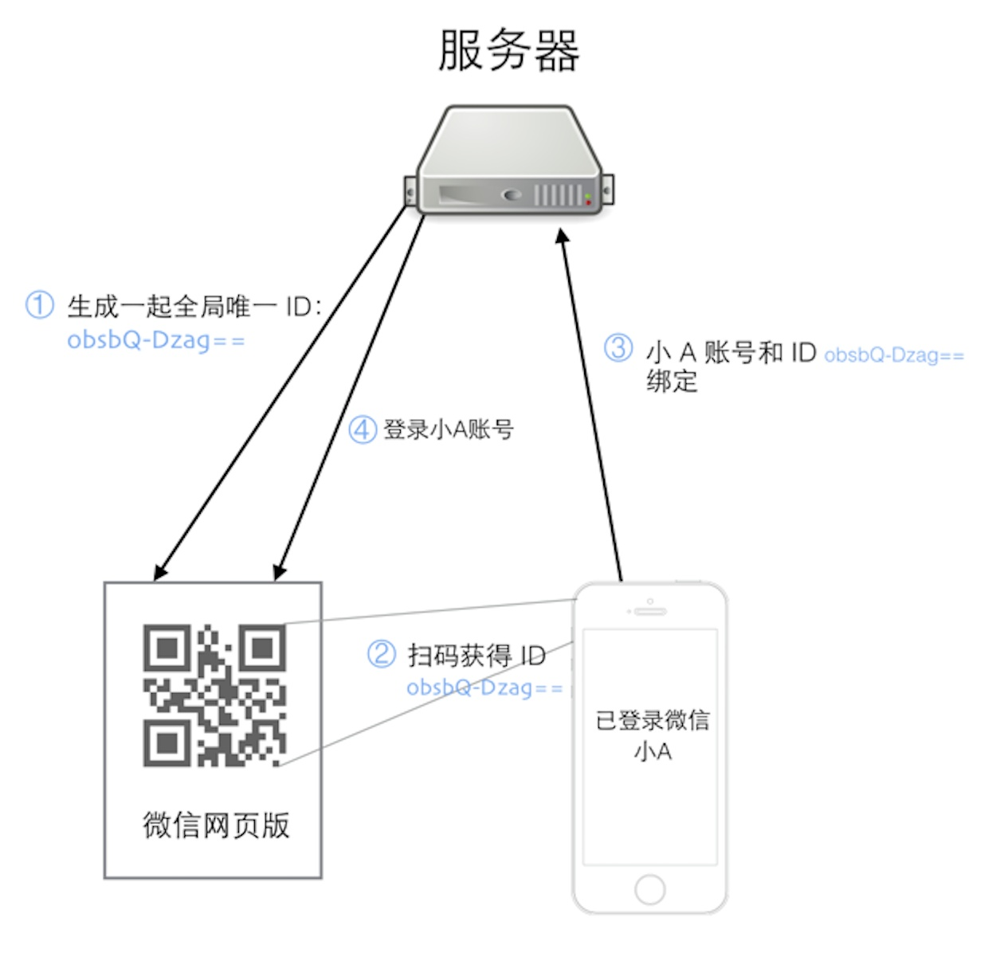

# Web 扫码登录实现
 基于 Workerman 做了一个扫码登录示例，给有需要的朋友参考一下。发现问题，欢迎指正。

## 实现流程图

## 运行流程
①：用户 A 访问微信网页版，微信服务器为这个会话生成一个全局唯一的 ID，上面的 URL 中 obsbQ-Dzag== 就是这个 ID，此时系统并不知道访问者是谁。

②：用户A打开自己的手机微信并扫描这个二维码，并提示用户是否确认登录。

③：手机上的微信是登录状态，用户点击确认登录后，手机上的微信客户端将微信账号和这个扫描得到的 ID 一起提交到服务器

④：服务器将这个 ID 和用户 A 的微信号绑定在一起，并通知网页版微信，这个 ID 对应的微信号为用户 A，网页版微信加载用户 A 的微信信息，至此，扫码登录全部流程完成

扫码登录看起来神奇，主要是因为微信 APP 扫自家的码会做一些普通二维码软件不会做的额外的操作，那就是将当前已登录的微信和扫出来的 ID 提交到微信服务器，类似的应用还有扫码支付、扫码加公众号等功能，关于二维码在产品设计中的应用，推荐另一篇文章：《二维码这把利刃，产品应该用到极致》。

> 以上内容 来自互联网。

## 运行示例（Win）
在windows 下双击 login_start_for_win.bat 即可